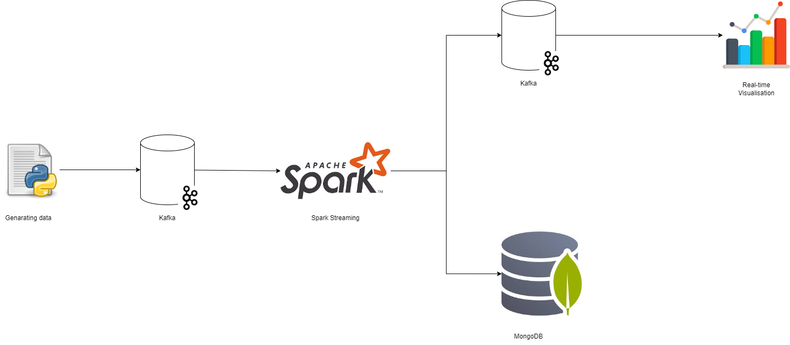
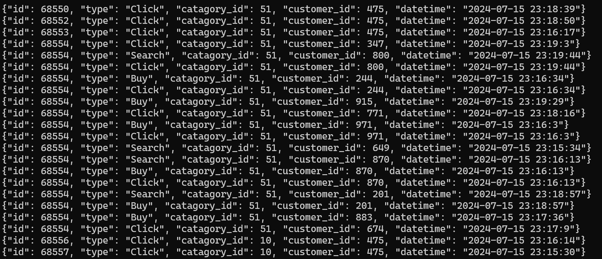
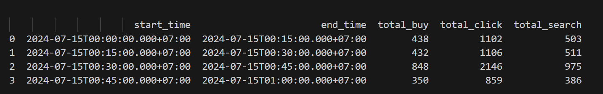
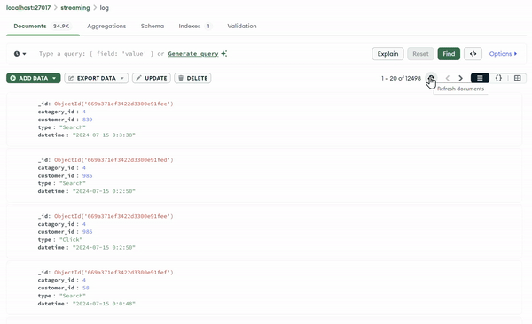
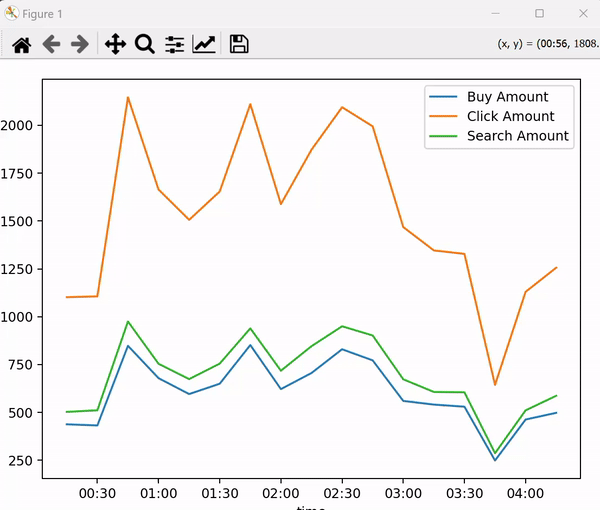

# DATA PIPELINE WITH SPARK STREAMING AND KAFKA

### 1. Model

### 2. Genarating data
- [Python Script](2-create-logs.py) makes continuously new logs and send them into Kafka
- Each data has id field, type field (Search|Click|Buy), catagory_id, customer_id, datetime

### 3. Transforming and storing data
- [Spark](3-pyspark-streaming.py) real-time aggregates clicks, buys, and searches from Kafka based on time period

- [Spark](3-pyspark-streaming.py) save logs to MongoDB

### 4. Visualization
- [Python Script](4-real-time-graph.py) uses matplotlib and pandas libraries to make a real-time line graph

